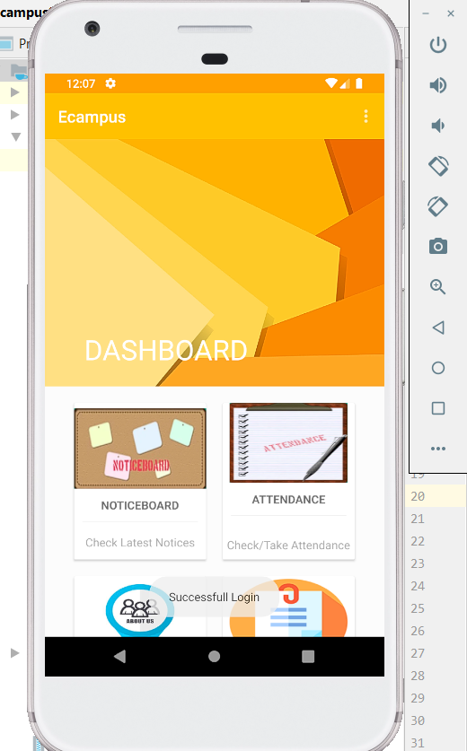
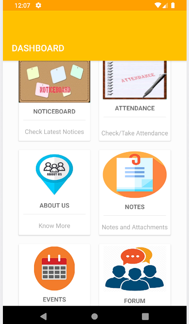

# E-Campus-Android-App
Introducing the android application software which would make easy for college to communicate with students. Admin or Teachers can directly upload the notices,events,notes from the app and it will available to all the registered students to view and download. Teachers can also take attendance from the app and record of the attendance is stored where student will have option to view particular subject attendance or total calculated attendance. Forums section is for discussions by students and teachers.

# Screenshots

